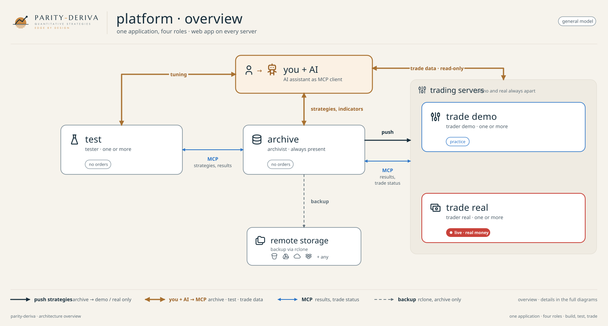
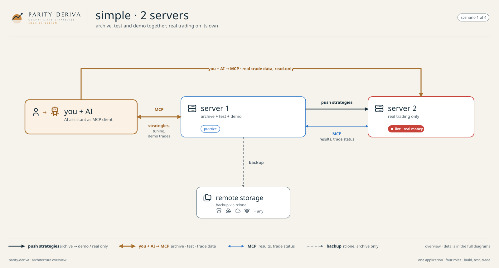
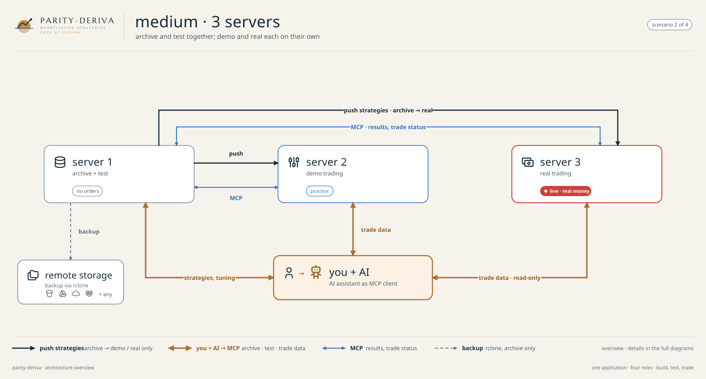
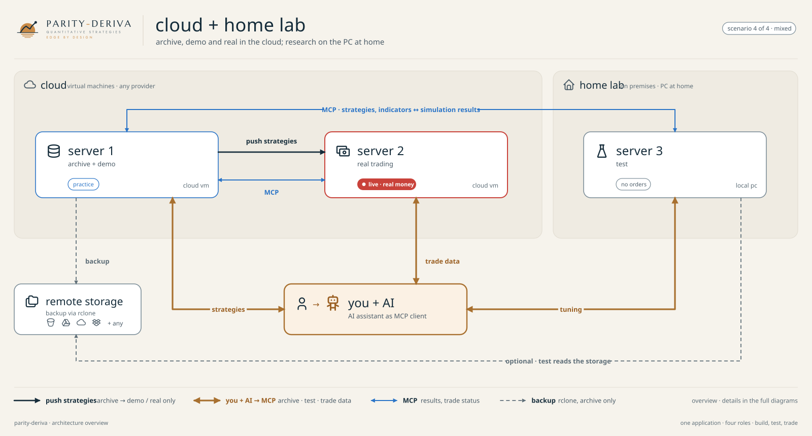

# Architecture

One application, four roles. Every server runs the same code: its roles say
what it does, and its `.env` says whether it trades demo accounts or real
money. The servers talk to each other, and to an AI assistant, over MCP.

Each picture below is the simplified version. Click it to open the detailed one.

## The four roles

| role | server | what it does | never does |
|---|---|---|---|
| **archivist** | archive, always present | keeps strategy and indicator code, market data, simulation results and the economic calendar; takes a test server's pushes; pushes strategies to the trade servers and reads their trades every 5 minutes; moves old simulations to remote storage | place orders |
| **tester** | test, one or more | backtests, sets and mixes; takes the AI assistants' drafts; can share the archive's server | place orders |
| **trader demo** | trade, one or more | runs sessions on demo accounts; sends results and trade status to the archive | take code any way but a push |
| **trader real** | trade, one or more, on a server of its own | the same with real money; starts only what the archive promoted with a demo record it judges enough | take code any way but a push; share a server with demo |

The roles are in `DATA_DIR/server.json`, set on the settings page ("this
server") or at the first start. With no file a server is archive, test and
trade at once. Demo or real is not a role: it is `PARITY_DERIVA_ACCOUNTS` in
`.env`, never set from a page, so a click cannot turn a demo server into a real
money one. Details: [Server roles](../README.md#server-roles-archive-test-trade).

## What moves between them

| arrow | from → to | what |
|---|---|---|
| **push strategies** (dark, solid) | archive → demo / real | the only way code reaches a trade server: the strategy, its indicators (drafts there, enabled by hand) and the run it starts from; to a real money server also its record on demo |
| **MCP** (blue) | trade → archive | results and trade status, read by the archive every 5 minutes (`live_status`) |
| **MCP** (blue) | test ↔ archive | strategies, indicators and simulation results: `scripts/sync.py push` and `pull` |
| **you + AI → MCP** (bronze) | assistant → archive, test, trade | one MCP client, three uses: strategies and indicators on the archive, tuning parameters and the test algorithm on a test server, trade data on demo and real, read-only |
| **remote storage** (dashed) | archive → storage | old simulations off the disk, brought back when one is opened: an S3 bucket, a Google Drive or a OneDrive (through rclone), chosen on the settings page; only the archive writes |
| **browser** (dotted) | you → any server | the web app over https; on the archive also direct upload of candles, calendar, strategy and indicator code |

Each server gives every program a token with a role that says what it may call
over MCP (`pc`, `mirror`, `market`, `promote`). Details:
[Programs' tokens](../README.md#programs-tokens-the-test-and-the-archive).

## Demo and real money

Demo and real always run on separate servers, for safety and for performance.
A real money server:

- starts a session only for a form the archive promoted, with a demo record
  it judges itself: enough days, enough closed trades, no parity alarm, demo
  accounts only;
- asks for the capital at risk to be confirmed before it starts;
- stops every session at the day's loss limit, and starts none before the next
  UTC day; "stop all" stops them by hand;
- over MCP takes only what the archive promotes: no assistant writes
  strategies there or runs backtests.

Details: [A server for demo accounts, another for real money](../README.md#a-server-for-demo-accounts-another-for-real-money).
The path of a strategy across these servers, from simulation to demo to live,
is in [PROCESSO.md](PROCESSO.md) (Italian).
How a simulation runs inside one server is in [ENGINE.md](ENGINE.md).

## Market data

One server writes the market folder (candles, spread, calendar); the others
read it (`market.json`) or copy it from an upstream with a `mirror` token. A
trade server and the PC take theirs from the archive. Details:
[One market folder for several servers](../README.md#one-market-folder-for-several-servers).

## Deployments

The same four roles, laid out on as many servers as you like. Four common
layouts:

| # | layout | servers |
|---|---|---|
| 1 | simple | archive + test + demo · real |
| 2 | medium | archive + test · demo · real |
| 3 | complex | N independent servers: the platform picture above is the general case |
| 4 | mixed | archive + demo (cloud) · real (cloud) · test (PC at home) |

### 1 · Simple: two servers

Archive, test and demo trading share one instance, so a strategy reaches demo
trading on the same server. Real money runs on the second one, which has no
access to the archive's data.

### 2 · Medium: three servers

Archive and test together; demo and real each on its own server. Both trade
servers get strategies by push and send their trades back over MCP.

### 4 · Mixed: cloud and home lab

Archive, demo and real on virtual machines at any cloud provider; simulations
on the PC at home, which pushes what is worth trading to the archive with
`scripts/sync.py`. The drawing also shows an optional read-only access from
the PC to the remote storage.

## Setting a server up

`docker compose up -d`, then the setup page asks three things:

- how people get in: a client certificate, a Google, Microsoft 365 or GitHub
  account on a list, both at once, or nothing (a PC only);
- what the server is for: archive, test, trade on demo accounts or with real
  money;
- where its market data comes from: the archive, or your own files.

Details: [Docker](../README.md#docker).

## The diagrams

The SVGs are in [`architecture/`](architecture/): the detailed ones at the top,
the simplified ones in `overview/`, the pictures they started from in
`originali/`, and the scripts that draw them in `sorgenti/`. How to redraw
them: [architecture/README.md](architecture/README.md).
