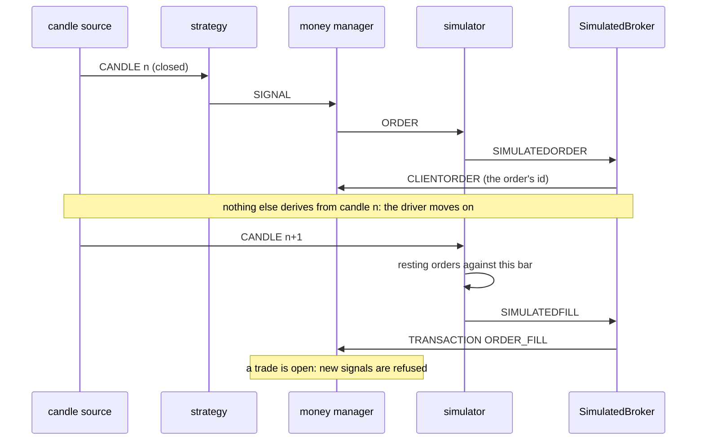
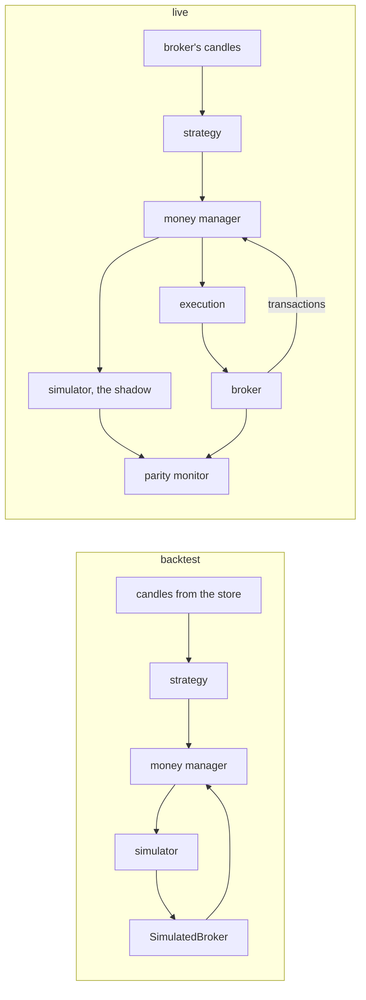

# The simulation engine

Everything that happens is an **event** on one bus, and every component is a
**handler**: it reads the events it cares about and puts new ones on the bus.
A candle comes in, a strategy turns it into a signal, the money manager turns
the signal into an order, and a broker (or the simulator, playing one) fills
it.

The same handlers run live and in a backtest. Three things change between the
two: where the candles come from, which driver moves the events, and who plays
the broker.

## Events

An event is a small dictionary-backed object (`event/event.py`). Its type is
its class name without `Event`, upper case, and a handler dispatches on
`str(event)`. Every event can be written as one JSON line and read back.

| event | put by | read by | what it says |
|---|---|---|---|
| `CANDLE` | the candle source | everyone | one closed bar, ask and bid open/high/low/close, instrument, granularity |
| `SIGNAL` | a strategy | money manager | enter: side, order type, entry, stop, target, the signal number |
| `ORDER` | money manager | execution, simulator | an order to place, sized |
| `CLIENTORDER` | broker (or `SimulatedBroker`) | money manager | the broker took the order: its id |
| `TRANSACTION` | broker (or `SimulatedBroker`) | money manager | `ORDER_FILL`, `ORDER_CANCEL`, `ORDER_REJECT` |
| `ORDERCANCEL` | money manager, a broker's poller, `SimulatedBroker` | execution, simulator, money manager | cancel a resting order (an instruction, not a report) |
| `STOPMODIFY` | trailer | execution, simulator | move the stop of an open trade |
| `CLOSETRADE` | session closer, trade timer | execution, simulator | close what is open on an instrument, now |
| `SIMULATEDORDER` `SIMULATEDFILL` `SIMULATEDORDERCANCEL` | simulator | `SimulatedBroker`, parity monitor, ledger | what the simulator did, in its own words |
| `STATUS` | anyone | everyone | `DONE`, `HALT`, `LIQUIDATE`, `RESUME` |

The simulator reports with its own event types on purpose. Live, it sits on
the same bus as the real execution handler: if its fills were `TRANSACTION`s,
the money manager would act on trades that never happened, and a cancel the
simulator issued about its own book would reach the real account.

## Handlers

| handler | file | reads | puts |
|---|---|---|---|
| candle source | `data/replay.py` (`ForexCandles`, offline) · the provider's stream (live) | – | `CANDLE` |
| strategy | `strategy/*.py` | `CANDLE` of its own granularity | `SIGNAL` |
| money manager | `portfolio/moneymanager.py` | `SIGNAL`, `CLIENTORDER`, `TRANSACTION`, `ORDERCANCEL`, `STATUS` | `ORDER`, `ORDERCANCEL` |
| trailer | `portfolio/trailer.py` | `CANDLE` | `STOPMODIFY` |
| session closer, trade timer | `portfolio/session.py` | `CANDLE` | `CLOSETRADE` |
| simulator | `backtest/oanda.py` (`OANDABacktester`) | `ORDER`, `CANDLE`, `ORDERCANCEL`, `STOPMODIFY`, `CLOSETRADE` | `SIMULATED*` |
| simulated broker | `backtest/offline.py` (`SimulatedBroker`) | `SIMULATED*` | `CLIENTORDER`, `TRANSACTION`, `ORDERCANCEL` |
| ledger | `backtest/ledger.py` | all of the above | nothing: it writes the trades down |
| execution (live) | `execution/*.py` | `ORDER`, `ORDERCANCEL`, and `STOPMODIFY` / `CLOSETRADE` where the broker can | sends them to the broker |
| transactions (live) | the provider's stream | – | `TRANSACTION` |
| parity monitor (live) | `trading/parity.py` | the real side and the simulated side | an alarm |
| event saver | `event/saver.py` | everything | one JSON line per event |

A strategy is a handler like the others. `AG01`, for example, reads a
`CANDLE`, and on two bars of opposite colour puts two `SIGNAL`s, a buy stop
and a sell stop, each with its stop and target. It never places an order
itself.

## Two drivers

### Live: `trading/engine.py`

One thread per source (each handler with a `stream_to_queue`): candles and
transactions. They all put events on one queue. The main loop takes one event
at a time and hands it to every handler in the order they were added; it
waits at most half a second (`heartbeat`) before checking that the sources
are still running. When a source ends, the loop dispatches
what is still queued and stops.

That is right live, because candles arrive minutes apart: an order derived
from one bar is resting long before the next bar arrives.

### Offline: `backtest/driver.py`

`ReplayEngine` has no threads. It reads the whole source first, then feeds
one candle at a time and dispatches **everything that candle causes, until
nothing is left**, before it touches the next one.

The threaded engine cannot do this. Replaying from memory, the source fills
the queue with the whole month before the first order derived from the first
candle exists. The simulator then has nothing resting to fill, and the run
reports no trades, which looks like a strategy that never triggers.

With the replay driver, when candle N is read, the book holds exactly the
orders candles 1 to N−1 produced. A guard stops a run in which two handlers
keep feeding each other (more than 10 000 events from one candle).

## Same components, two wirings

Offline, `SimulatedBroker` turns the simulator's reports into the events a
broker sends (`SIMULATEDFILL` → `TRANSACTION` `ORDER_FILL`, and so on), so the
loop closes. Adding it says "the simulator is the broker here". The simulator
itself has one behaviour only, and that is the component every comparison
rests on.

Offline the handlers are added in this order (`backtest/ledger.run`):
strategy, money manager, trailer, simulator, `SimulatedBroker`, ledger, then
the session closer, the trade timer and the progress reporter when asked for.
The order matters: the trailer comes **before** the simulator, so a stop moved
on a bar applies from the next bar. A stop moved and taken on the same bar
would be reading the future. Live does the same (`scripts/live.py`).

## How the simulator fills

Every candle carries **ask and bid**. A buy trades against the ask and a sell
against the bid, whatever the order is for. So a long enters on the ask, and
its stop and target are read off the bid. The spread is in the prices, not a
number added on top.

On each candle the simulator walks its resting orders for that instrument:

1. An order whose expiry (`gtdTime`) has passed is dropped first: it was not
   on the book when this bar traded.
2. A **market** order fills at this bar's open, the first price after the bar
   the strategy acted on.
3. A **resting** order fills at its own level when the level is inside the
   bar's low–high.
4. **Gap**: if the price jumped over the level between the last close and
   this open, the order fills at the open, the first price anybody could have
   had. For a stop that is worse than the level, for a target better.
5. A **stop already passed** at the open fills at the open.
6. **Several orders on one bar**: nearest to the open first. Coming out of the
   open, the nearer level is the one the price met first. The first entry that
   fills takes the other entries of the same signal off the book (an `AG01`
   straddle is one-cancels-the-other).
7. A trade closed by its stop or its target takes the other leg off the book.
   A `CLOSETRADE` closes at the bar's close.

Profit and loss is (exit − entry) × units. Financing is 0 and there is no
commission.

## What a bar cannot say

A bar gives four prices, not the order they came in. When a trade's stop and
target are both inside one bar, the bar does not say which was touched first.
Two modules deal with it:

- `backtest/resolution.py` **measures** it: it resolves the same trades on
  coarse and on fine bars and counts how often they disagree.
- `backtest/shadow.py` **removes part of it**: the strategy still reads its
  own bars (H4, say), but the simulator fills against the finest bars in the
  store for the same instrument (M5). Two streams on one bus are ordered by
  **when a bar closed**: an H4 bar is dispatched after the M5 bars inside it.
  The finer series is used only if it covers the whole window. Over
  1 000 000 fine bars a run falls back to the next coarser series.

## No look-ahead

- A strategy acts on a closed bar. Its order can fill from the next bar on.
- The trailer reads a closed bar and moves the stop for the next one.
- Two granularities are ordered by close time, never by open time.
- Live, the first bar a signal may come from is the one still forming when
  the session started (`notBefore`): the same rule as a backtest, where every
  bar closes before its order is placed.

## The money manager's rules

- **One trade at a time.** A new signal number is refused while orders of the
  last one are still outstanding. A signal whose orders all died (expired,
  rejected, cancelled) is released and the block lifts; one holding a fill is
  not.
- **Size.** Either fixed units, or a risk per trade: `capital × risk / |entry −
  stop|`, so a trade stopped out costs that share of the capital. The capital
  is re-read at the start of each calendar month, not after every close. A
  signal with no stop cannot be sized and is not sent.
- **Account rules**, the same for every strategy: trading hours (`session`),
  no signals near calendar events (`news`), the widest stop allowed
  (`maxStopPips`), stop and target scaled (`slScale`, `tpScale`), orders
  turned round (`inverse`), a trailing stop (`trailing`).
- Its bookkeeping lives on the class, so two runs in one process would share
  it. `ledger.moneyManager()` builds one that starts empty for each run.

## Live: the shadow and the parity check

Live, the simulator runs next to the real execution handler, on the same
candles and the same orders. `ParityMonitor` pairs each real trade with its
simulated twin by the **signal key**, which is made from the candle that
produced the signal, so the same key appears on both sides and in any later
replay. It counts where they disagree: a different outcome, slippage, a trade
on one side only.

It does not judge single trades, because a bar-driven simulator cannot say
which of stop and target came first, so some disagreement is built in
(`scripts/divergence_band.py` measures how much). It keeps a rolling window,
waits for a minimum number of trades, and compares a rate with the thresholds
in `PARITY_ALARM` (`etc/settings.py`), per instrument. Over the threshold it
warns or halts the session.

## Audit trail and replay

`EventSaver` writes every event as a JSON line. `EventReplay`
(`event/replay.py`) streams a saved log back onto a bus, so a live session can
be run again through the same handlers.

## Plugins with their own loop

A strategy that opens several positions per signal, or moves a stop on a rule
the money manager is not shaped for, can bring its own bar loop as a viewer
plugin (`strategy/plugins.py`). The viewer draws it the same way: chart,
trades, report. An account option its engine does not apply is refused rather
than ignored.

## Where to start reading

1. `trading/handler.py`: what a handler is.
2. `event/event.py`: the events.
3. `backtest/driver.py`: the offline driver.
4. `backtest/ledger.py`, `run()`: the offline wiring, start to end.
5. `backtest/oanda.py`, `checkOrder()` and `fillAt()`: the fill rules.
6. `portfolio/moneymanager.py`: from a signal to an order.
7. `backtest/shadow.py` and `backtest/resolution.py`: fine bars under coarse
   ones.
8. `scripts/live.py` and `trading/parity.py`: the live wiring and its shadow.
