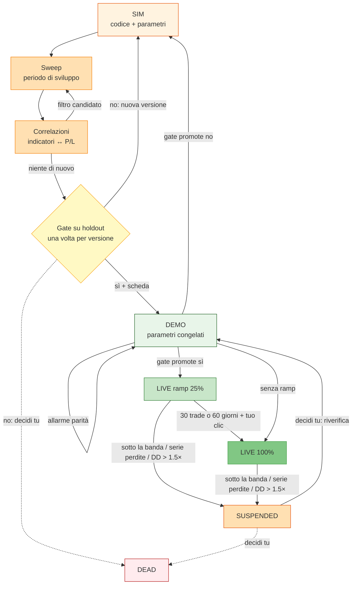

# Processo sviluppo strategie: SIM → DEMO → LIVE

Versione corta della fase 1, una strategia alla volta. Quella completa è
[PROCESSO.md](PROCESSO.md); il mix e il resto sono in [ROADMAP.md](ROADMAP.md).

## In una riga

Una strategia è **codice + parametri**. Si cerca una buona combinazione in
simulazione (sweep + correlazioni, in loop), la si prova in **demo** sullo
stesso broker, poi va **live**. Niente paper trading. Ogni passaggio ha un
gate scritto: se non passa, torna indietro. Scartarla (`DEAD`) lo decidi
sempre tu.

---

## Stati

| Stato | Cosa vuol dire |
|---|---|
| `SIM` | in simulazione: sweep, correlazioni, loop |
| `DEMO` | parametri congelati, gira su un account demo |
| `LIVE` | soldi veri: a size ridotta (ramp) se lo scegli, poi piena |
| `SUSPENDED` | fermata da una protezione, in attesa di verifica |
| `DEAD` | scartata, sempre da te |

ALIVE = `LIVE`.

**Versioni.** Una strategia ha nome e versione (es. `M1502 v3`). In `SIM` i
parametri cambiano liberamente. Da `DEMO` in poi sono congelati: cambiare
codice o parametri crea una nuova versione, che riparte da `SIM`. Le
versioni si contano, senza limite.

---

## Regola sui dati (contro l'overfitting)

Lo storico si divide in due pezzi:

- **sviluppo**: la parte vecchia. Sweep e correlazioni vedono solo questa.
- **holdout**: l'ultimo ~25% dello storico, almeno 1 anno. Nessuno lo guarda
  durante il loop. Il taglio resta fisso finché non lo sposti tu: solo in
  avanti, lasciando almeno 1 anno.

L'holdout si apre **una volta per versione**, al gate SIM → DEMO. Se la versione non passa,
torna a `SIM`: riprovare con una versione nuova o scartare la strategia
(`DEAD`) lo decidi tu. La piattaforma conta quante volte l'holdout di quello
strumento è stato aperto e lo mostra nel gate: più aperture, meno l'holdout
è un dato mai visto. È un'informazione, non un blocco.

Gli sweep sul periodo di sviluppo sono **liberi**: quanti ne servono, anche
tanti quando i parametri spostano molto i risultati. Non si contano e non
pesano sul giudizio. Dall'overfitting proteggono l'holdout, che nessuno sweep
vede, e l'altopiano al gate: il punto scelto deve avere vicini buoni anche
loro.

---

## Fase 1 – SIM (loop)

```text
strategia (codice + parametri)
  → sweep sul periodo di sviluppo
  → correlazioni indicatori ↔ profit/loss
  → nuovi filtri come parametri dello sweep
  → di nuovo sweep ...
  → quando non migliora più: gate su holdout
```

### 1.1 Strategia = codice + parametri

- Codice in `strategy/` (o caricato via MCP, `strategy/uploaded.py`).
- Nel `DESCRIPTION` della classe, oltre alle regole, due righe:
  - **Ipotesi**: perché dovrebbe funzionare.
  - **Non opera quando**: le condizioni in cui non deve lavorare.

### 1.2 Sweep

- Griglia sui parametri della strategia e sulle opzioni dell'account, che
  già esistono nello sweep:
  - `session` (ore UTC in cui accetta segnali), `news` (finestra attorno
    agli eventi del calendario), `intraday`, `maxBars`
  - `slScale`, `tpScale`, `maxStopPips`, `trailing`, `trailProfit`,
    `trailPips`, `inverse`
  - lo strumento: una lista nel campo = un backtest per strumento.
- Ore e giorni **non sono una fase**: sono opzioni dello sweep.
- Limite: 500 combinazioni per set (`MAX_COMBOS`, `web/service.py`).
- Leggere `paramEffects` (`web/static/sim.js`): scegliere un **altopiano**
  (vicini buoni anche loro), non il picco isolato.

### 1.3 Correlazioni indicatori ↔ profit/loss (motore da fare)

Obiettivo: trovare valori di indicatori all'ingresso che separano i trade
buoni da quelli cattivi.

Cosa fa:

1. Prende i trade di un run (solo periodo di sviluppo).
2. Per ogni trade calcola gli indicatori sulla **barra chiusa prima del
   segnale** (niente sguardo al futuro). Catalogo: `lib/indicators.py` +
   indicatori AI abilitati. Regime (slope, ATR, volatilità) = indicatori
   come gli altri, non una fase a parte.
3. Per ogni indicatore divide i trade in 5 fasce (quintili) e per fascia
   dà: numero trade, win rate, expectancy in R, profit factor.
4. Calcola l'intervallo di confidenza con bootstrap (si può riusare
   `block_ci` di `scripts/entry_excursions.py`).
5. Restituisce una classifica di **filtri candidati**, es.
   `RSI14 < 55 → expectancy +0.3R, 240 trade, CI [+0.1, +0.5]`.

Regole:

- Fasce con meno di 30 trade: ignorate.
- Con 20 indicatori provati, circa 1 esce "significativo" per caso. Quindi
  un candidato **non è mai una regola**: diventa un nuovo parametro dello
  sweep e deve superare l'holdout.

### 1.4 Loop

Candidato → parametro dello sweep → nuovo sweep → di nuovo 1.3.
Ci si ferma quando niente migliora in modo chiaro, o prima: meno filtri =
meno overfitting.

### Gate SIM → DEMO

Sul **periodo di sviluppo**:

- almeno **100 trade**
- profit factor: il **limite basso** dell'intervallo bootstrap al 90% è > 1
- parametri su un altopiano: i vicini nella griglia hanno PF > 1
- PF > 1 anche **togliendo i 3 trade migliori**
- batte la **baseline casuale**: stessi exit e sizing, ingressi a caso alla
  stessa ora; il PF della strategia supera il 95° percentile dei casuali

Sull'**holdout** (aperto una volta):

- net > 0
- PF holdout ≥ 0.7 × PF sviluppo
- max drawdown holdout ≤ 1.5 × max drawdown sviluppo

Costi: lo spread è già dentro (fill su ask/bid veri). Commissioni e
financing oggi sono a zero: vanno aggiunti per i broker che li hanno.

**Uscita del gate: la scheda di riferimento**, calcolata su sviluppo +
holdout e usata in demo e live:

- PF, expectancy, win rate, max drawdown, peggiore serie di perdite
- **banda Monte Carlo**: rimescolando l'ordine dei trade, i percentili 5° e
  95° della curva di equity trade per trade.

---

## Fase 2 – DEMO

- Sessione su un server demo, stesso broker del live (`.env`, `ACCOUNTS`).
- Il monitor di parità confronta la demo con un simulatore ombra sulle
  stesse candele (`trading/parity.py`). Un allarme di parità è un problema
  di **esecuzione**, non di edge: si sistema l'esecuzione e si resta in
  `DEMO`.
- Parametri congelati.
- Si può andare in demo anche senza gate, per provare in fretta: la pagina
  lo dice. Senza gate non c'è la scheda, e senza scheda niente live.

### Gate DEMO → LIVE (`promote()`, `web/livesessions.py`)

Già fatto:

- almeno `PROMOTE_DAYS` giorni (20) e `PROMOTE_TRADES` trade (30); da
  aggiungere per i timeframe lenti: oppure almeno 10 trade dopo 90 giorni
- nessun allarme di parità
- solo account demo nel record

Da aggiungere:

- la scheda: gate SIM → DEMO passato
- net ≥ 0
- la curva demo **mai sotto il 5° percentile** della banda Monte Carlo
- serie di perdite ≤ la peggiore della scheda

Se non passa: resta in `DEMO`, torna a `SIM` (nuova versione) o `DEAD`.
Decidi tu.

---

## Fase 3 – LIVE

- Promozione con push dal server demo (c'è già). Il server reale rifiuta un
  form non promosso (c'è già).
- **Ramp**, se lo scegli (acceso di default): **25% del capitale** fino al
  primo tra 30 trade e 60 giorni; poi 100% con un tuo clic, senza trade
  aperti.

### Protezioni

Per tutto il server (ci sono già):

- loss limit giornaliero `DAILY_LOSS_PCT` (3%)
- stop all (`stopAll`)

Per strategia (da fare):

| Evento | Azione |
|---|---|
| drawdown > 1.5 × max drawdown della scheda | `SUSPENDED`, con la proposta di scartarla |
| curva sotto il 5° percentile della banda | `SUSPENDED` |
| serie di perdite > 1.5 × la peggiore della scheda | `SUSPENDED` |

Più strategie insieme (mix) e portafoglio: fase 2 e 3, in [ROADMAP.md](ROADMAP.md).

### Monitoraggio

- Ogni settimana: ultimi 50 trade contro la scheda.
- Avviso a ogni cambio di stato (oggi non c'è nessun canale di notifica).

### SUSPENDED

La sessione si ferma. Poi decidi tu: riverificare in `DEMO`, tornare a
`SIM` o `DEAD`. Dopo un DD oltre 1.5× o alla seconda sospensione la pagina
propone `DEAD`, ma non lo applica.

---

## Dove sta tutto

| Cosa | Dove |
|---|---|
| codice + regole + ipotesi | `strategy/`, `DESCRIPTION` |
| sweep e run | `runs/sweeps/` (c'è già), cantina S3 / Drive (c'è già) |
| soglie della policy | `etc/settings.py`, accanto a `PROMOTE_*` e `DAILY_LOSS_PCT` |
| diario della strategia: tutto quello che si fa, scritto da parity-deriva, più le note dell'utente | un file per strategia in `DATA_DIR/journal/` (da fare) |
| scheda della versione: stato, riferimento, aperture dell'holdout | un JSON per versione in `DATA_DIR/cards/` (da fare) |

Lo storico dei cambi di stato va nel diario.

---

## Cosa manca, in ordine

1. **Gate performance in `promote()`** + scheda di riferimento dalla SIM.
   Piccolo. Oggi una strategia in perdita in demo passa.
2. **Diario della strategia** + scheda della versione. Medio-grande.
3. **Holdout nello sweep**: periodo sviluppo/holdout, holdout aperto una
   volta per versione. Medio.
4. **Motore correlazioni** (1.3). Medio-grande.
5. **Banda Monte Carlo + baseline casuale**. Medio.
6. **Live**: protezioni per strategia, ramp al 25%, ultimi 50 trade, avvisi.
   Medio.
7. Piccoli: giorno della settimana come opzione dello sweep (le ore ci sono
   già con `session`), commissioni e financing, colonna R nei trade.

---

## Flusso


